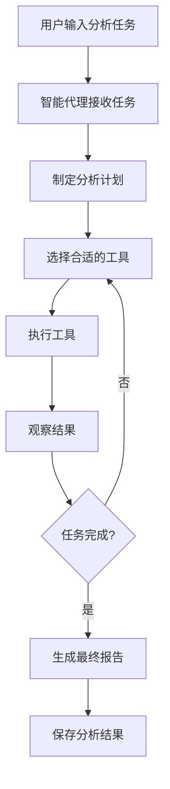

# LangChain 智能代理使用指南

## 概述

本项目集成了 **LangChain** 智能代理框架，实现了智能规划和工具调用的代码分析能力。智能代理可以自主决定使用哪些工具、以什么顺序执行分析任务，提供更深入、更全面的代码分析。

## 架构设计

### 核心组件

```
src/agent/
├── __init__.py
└── langchain_agent.py      # LangChain 智能代理实现

src/
└── intelligent_scanner.py  # 集成智能代理的目录扫描器
```

### 智能代理工具集

智能代理配备了以下专业工具：

1. **analyze_code_quality** - 分析代码质量
   - 代码结构和组织
   - 命名规范
   - 注释完整性
   - 代码可读性

2. **detect_bugs** - 检测潜在 bug
   - 逻辑错误
   - 空指针风险
   - 边界条件问题

3. **suggest_improvements** - 提供改进建议
   - 重构建议
   - 性能优化
   - 最佳实践

4. **analyze_security** - 安全分析
   - SQL 注入风险
   - XSS 漏洞
   - 敏感信息泄露

5. **extract_dependencies** - 提取依赖关系
   - 导入的库和模块
   - 外部依赖分析

6. **calculate_complexity** - 计算代码复杂度
   - 圈复杂度
   - 认知复杂度
   - 代码行数统计

7. **generate_summary** - 生成代码摘要
   - 功能描述
   - 核心逻辑总结

## 安装依赖

```bash
# 安装 LangChain 相关依赖
pip install -r requirements.txt

# 或手动安装
pip install langchain>=0.1.0 langchain-community>=0.0.10 langchain-core>=0.1.0
```

## 使用方法

### 方式一：使用智能目录扫描器

```bash
# 基本用法 - 使用智能代理分析
python3 src/intelligent_scanner.py /path/to/project -o agent_reports -e .java

# 禁用智能代理，使用基础模式
python3 src/intelligent_scanner.py /path/to/project -o reports -e .java --no-agent
```

### 方式二：直接使用智能代理 API

```python
from src.agent.langchain_agent import CodeAnalysisAgent

# 创建智能代理
agent = CodeAnalysisAgent()

# 示例代码
code = """
def calculate_total(items):
    total = 0
    for item in items:
        total += item['price'] * item['quantity']
    return total
"""

# 方法 1: 简单分析
result = agent.analyze(
    task="请分析这段代码的质量和潜在问题",
    code=code
)
print(result)

# 方法 2: 规划和执行
result = agent.plan_and_execute(
    objective="对这段代码进行完整的代码审查",
    context={
        "language": "Python",
        "code": code,
        "file_path": "calculator.py"
    }
)
print(result)
```

## 工作原理

### ReAct 框架

智能代理基于 **ReAct (Reasoning + Acting)** 框架工作：

```
1. Question: 用户的分析任务
2. Thought: 代理思考要做什么
3. Action: 选择要使用的工具
4. Action Input: 工具的输入
5. Observation: 工具的输出
6. ... (重复 2-5 直到完成)
7. Final Answer: 最终分析结果
```

### 执行流程



## 示例

### 示例 1: 分析单个文件

```bash
python3 src/intelligent_scanner.py examples/ -o agent_analysis -e .java
```

**输出示例：**

```
🔍 开始扫描目录: examples/
📝 支持的文件类型: .java
✓ LangChain 智能代理已初始化

✓ 扫描完成，找到 2 个文件
  总大小: 15.32 KB

进度: [1/2]
================================================================================
📄 分析文件: Application.java
🔤 语言: Java
================================================================================

🤖 使用智能代理进行深度分析...

================================================================================
📊 智能代理分析结果
================================================================================

【分析计划】
1. 首先分析代码质量
2. 检测潜在 bug
3. 分析安全隐患
4. 提供改进建议
5. 计算代码复杂度

【分析结果】
[详细的分析报告...]

✓ 分析报告已保存: agent_analysis/Application_java_agent_analysis_20251207_055000.md
```

### 示例 2: 直接使用代理 API

```python
from src.agent.langchain_agent import CodeAnalysisAgent

# 创建代理
agent = CodeAnalysisAgent()

# 分析代码
code = """
public class UserService {
    public User getUser(String id) {
        return database.query("SELECT * FROM users WHERE id = " + id);
    }
}
"""

result = agent.plan_and_execute(
    objective="检查这段代码的安全问题",
    context={
        "language": "Java",
        "code": code
    }
)

print(result['plan'])
print(result['execution_result'])
```

## 配置选项

### 智能代理配置

```python
# 自定义 Ollama 配置
agent = CodeAnalysisAgent(
    ollama_url="http://localhost:11434",
    model="qwen2.5:7b"  # 使用更大的模型
)
```

### 扫描器配置

```bash
# 完整参数示例
python3 src/intelligent_scanner.py \
    /path/to/project \
    -o agent_reports \
    -e .java .py .js \
    --max-size 512000 \
    --ignore-dirs test docs \
    --no-agent  # 可选：禁用智能代理
```

## 生成的报告

### 单个文件报告

文件名格式: `<文件路径>_agent_analysis_<时间戳>.md`

内容包括：
- 文件基本信息
- 分析计划
- 详细分析结果
  - 代码质量评估
  - 潜在问题
  - 安全隐患
  - 改进建议
  - 复杂度分析

### 汇总报告

- **Markdown 格式**: `agent_summary_<时间戳>.md`
- **JSON 格式**: `agent_summary_<时间戳>.json`

包含：
- 统计信息
- 所有文件的分析状态
- 分析模式（智能代理 vs 基础模式）

## 性能优化

### 1. 使用更大的模型

```python
# 使用 7B 模型获得更好的分析质量
agent = CodeAnalysisAgent(model="qwen2.5:7b")
```

### 2. 限制文件大小

```bash
# 只分析小于 500KB 的文件
python3 src/intelligent_scanner.py /path/to/project --max-size 512000
```

### 3. 批量处理

```bash
# 分目录处理大型项目
python3 src/intelligent_scanner.py /project/src -o reports/src
python3 src/intelligent_scanner.py /project/tests -o reports/tests
```

## 故障排除

### 问题 1: LangChain 导入错误

**错误**: `ModuleNotFoundError: No module named 'langchain'`

**解决方案**:
```bash
pip install langchain langchain-community langchain-core
```

### 问题 2: Ollama 连接失败

**错误**: `Error calling Ollama: Connection refused`

**解决方案**:
```bash
# 确保 Ollama 服务运行
ollama serve

# 或使用 Docker
docker-compose up -d ollama
```

### 问题 3: 智能代理初始化失败

**提示**: `⚠️ 智能代理初始化失败`

**解决方案**:
- 系统会自动降级到基础分析模式
- 检查 Ollama 服务状态
- 检查 LangChain 依赖是否正确安装

## 与基础扫描器的对比

| 特性 | 基础扫描器 | 智能代理扫描器 |
|------|-----------|--------------|
| 分析深度 | 单次 LLM 调用 | 多工具协同分析 |
| 规划能力 | 无 | 自动制定分析计划 |
| 工具使用 | 无 | 7+ 专业工具 |
| 分析全面性 | 中等 | 高 |
| 执行时间 | 快 | 较慢（更深入）|
| 适用场景 | 快速扫描 | 深度代码审查 |

## 进阶用法

### 自定义工具

```python
from langchain.tools import Tool
from src.agent.langchain_agent import CodeAnalysisAgent

# 创建自定义工具
def custom_analysis(code: str) -> str:
    # 你的自定义分析逻辑
    return "分析结果"

custom_tool = Tool(
    name="custom_analysis",
    func=custom_analysis,
    description="自定义分析工具"
)

# 添加到代理
agent = CodeAnalysisAgent()
agent.tools.append(custom_tool)
```

### 集成到 CI/CD

```yaml
# .github/workflows/code-analysis.yml
name: Code Analysis

on: [push, pull_request]

jobs:
  analyze:
    runs-on: ubuntu-latest
    steps:
      - uses: actions/checkout@v2
      
      - name: Setup Python
        uses: actions/setup-python@v2
        with:
          python-version: '3.12'
      
      - name: Install dependencies
        run: pip install -r requirements.txt
      
      - name: Run intelligent scanner
        run: |
          python3 src/intelligent_scanner.py . -o ci_reports -e .py .java
      
      - name: Upload reports
        uses: actions/upload-artifact@v2
        with:
          name: analysis-reports
          path: ci_reports/
```

## 最佳实践

1. ✅ **首次使用建议使用小型项目测试**
2. ✅ **对重要代码使用智能代理模式**
3. ✅ **对快速扫描使用基础模式（--no-agent）**
4. ✅ **定期更新 LangChain 和 Ollama 模型**
5. ✅ **保存分析报告用于代码质量跟踪**

## 相关文档

- [DIRECTORY_SCANNER_GUIDE.md](DIRECTORY_SCANNER_GUIDE.md) - 基础扫描器使用指南
- [README.md](README.md) - 项目总览
- [LangChain 官方文档](https://python.langchain.com/)

---

**享受智能代码分析！** 🚀
