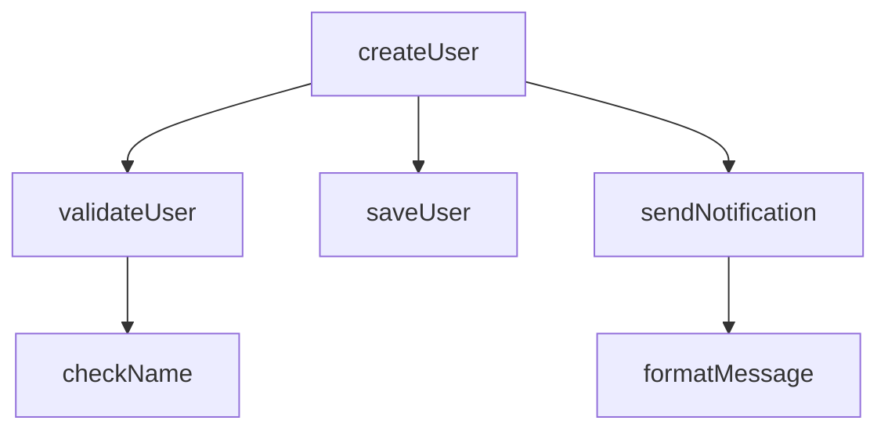

# 函数调用链分析功能使用指南

## 概述

Directory Scanner 现在支持函数调用链分析功能，可以：
- 📊 自动提取代码中的函数定义
- 🔗 构建函数调用关系图
- 🔄 检测循环调用和深度调用
- 📈 生成 Mermaid 流程图
- 🤖 基于调用链进行递归代码审核

## 功能特性

### 1. 函数提取
- 支持 Java 和 Python 代码
- 提取函数签名、参数、返回类型
- 记录函数位置（起始行和结束行）

### 2. 调用图构建
- 正向调用图：函数调用了哪些函数
- 反向调用图：函数被哪些函数调用
- 调用链追踪：完整的调用路径

### 3. 可视化
- Mermaid 流程图：可在 Markdown 中渲染
- 调用关系报告：详细的文本描述
- JSON 数据导出：便于进一步分析

### 4. 递归审核
- AI 分析会考虑函数调用关系
- 识别潜在的循环调用问题
- 评估函数职责和调用层次

## 使用方法

### 方法 1: 命令行使用

```bash
# 启用调用链分析
python src/directory_scanner.py /path/to/project \
  --enable-call-chain \
  -e .java \
  -o reports_with_callchain

# 组合其他功能
python src/directory_scanner.py /path/to/project \
  --enable-call-chain \
  --file-pattern ".*Service.*" \
  --ollama-url http://localhost:11434 \
  --model qwen2.5:0.5b \
  -o reports
```

### 方法 2: Python API 使用

```python
from src.directory_scanner import DirectoryScanner

# 创建扫描器并启用调用链分析
scanner = DirectoryScanner(
    root_dir="/path/to/project",
    output_dir="reports",
    extensions=['.java', '.py'],
    enable_call_chain=True  # 启用调用链分析
)

# 执行分析
results = scanner.analyze_all()

# 查看调用链信息
for result in results:
    if result.get('call_chain'):
        call_chain = result['call_chain']
        print(f"文件: {result['file_path']}")
        print(f"函数数量: {len(call_chain['functions'])}")
```

### 方法 3: 单独使用调用链分析器

```python
from src.call_chain_analyzer import CallChainAnalyzer

# 读取代码文件
with open('UserService.java', 'r') as f:
    code = f.read()

# 创建分析器
analyzer = CallChainAnalyzer(language='Java')

# 构建调用图
call_graph = analyzer.build_call_graph(code, 'UserService.java')

# 生成报告
report = analyzer.generate_call_chain_report()
print(report)

# 生成 Mermaid 图
mermaid = analyzer.generate_mermaid_diagram()
print(mermaid)
```

## 输出说明

### 1. Markdown 报告

启用调用链分析后，生成的报告包含以下部分：

```markdown
# 代码分析报告

**文件路径**: `UserService.java`
**编程语言**: Java
**分析时间**: 2025-12-08 13:36:00
**函数数量**: 6

---

## 📊 函数调用链分析

# 函数调用链分析报告
**编程语言**: Java
**函数总数**: 6
**调用关系数**: 11

## 统计信息
- **入口函数** (未被其他函数调用): 1
  - `createUser`

- **叶子函数** (不调用其他函数): 2
  - `checkName`
  - `saveUser`

## 详细调用链

### 函数: `void createUser(String name)`
- **文件**: `UserService.java`
- **位置**: 第 3-7 行
- **调用的函数**: `validateUser`, `saveUser`, `sendNotification`
- **调用链** (最多3层):
  1. createUser → validateUser → checkName
  2. createUser → saveUser
  3. createUser → sendNotification → formatMessage

### 调用关系图



---

## 🤖 AI 代码分析

[AI 分析结果，包含对调用链的评估]
```

### 2. JSON 数据文件

同时会生成 JSON 格式的调用链数据：

```json
{
  "file_path": "UserService.java",
  "language": "Java",
  "timestamp": "2025-12-08T13:36:00",
  "functions": [
    {
      "name": "createUser",
      "signature": "void createUser(String name)",
      "start_line": 3,
      "end_line": 7,
      "file": "UserService.java"
    }
  ],
  "call_graph": {
    "createUser": ["validateUser", "saveUser", "sendNotification"]
  },
  "reverse_call_graph": {
    "validateUser": ["createUser"],
    "saveUser": ["createUser"]
  }
}
```

## 使用示例

### 示例 1: 分析 Service 层代码

```bash
# 分析所有 Service 类，启用调用链分析
python src/directory_scanner.py \
  "/Users/mac/Desktop/cursor/lingtools/backend/src/main/java/com/lingtools/codegen/service/impl" \
  --file-pattern ".*Service.*" \
  --enable-call-chain \
  -e .java \
  -o service_callchain_reports
```

### 示例 2: 分析 Python 项目

```bash
# 分析 Python 项目的函数调用关系
python src/directory_scanner.py \
  ./src \
  --enable-call-chain \
  -e .py \
  --file-pattern ".*analyzer.*" \
  -o python_callchain_reports
```

### 示例 3: 完整分析流程

```bash
# 1. 先扫描查看有哪些文件
python src/directory_scanner.py /path/to/project -e .java

# 2. 启用调用链分析进行深度分析
python src/directory_scanner.py /path/to/project \
  --enable-call-chain \
  --file-pattern ".*Controller.*" \
  -e .java \
  -o detailed_reports

# 3. 查看生成的报告
ls -lh detailed_reports/
cat detailed_reports/*_analysis_*.md
cat detailed_reports/*_callchain_*.json
```

## 分析结果解读

### 1. 入口函数
- 未被其他函数调用的函数
- 通常是公共 API 或事件处理函数
- 应该关注这些函数的设计和文档

### 2. 叶子函数
- 不调用其他函数的函数
- 通常是工具函数或底层实现
- 应该确保这些函数职责单一

### 3. 调用链深度
- 深度过大可能表示设计复杂
- 建议调用链深度不超过 5 层
- 过深的调用链难以理解和维护

### 4. 循环调用
- 直接或间接的循环调用
- 可能导致栈溢出
- 需要仔细审查是否合理

## 高级功能

### 1. 调用链过滤

```python
from src.call_chain_analyzer import CallChainAnalyzer

analyzer = CallChainAnalyzer(language='Java')
analyzer.build_call_graph(code, 'file.java')

# 获取特定函数的调用链
chains = analyzer.get_call_chain('createUser', max_depth=3)
for chain in chains:
    print(' → '.join(chain))

# 获取反向调用链（谁调用了这个函数）
reverse_chains = analyzer.get_reverse_call_chain('saveUser', max_depth=3)
for chain in reverse_chains:
    print(' ← '.join(chain))
```

### 2. 调用图分析

```python
# 分析调用图特征
call_graph = analyzer.call_graph

# 找出调用最多函数的函数
most_calls = max(call_graph.items(), key=lambda x: len(x[1]))
print(f"调用最多的函数: {most_calls[0]} (调用了 {len(most_calls[1])} 个函数)")

# 找出被调用最多的函数
reverse_graph = analyzer.reverse_call_graph
most_called = max(reverse_graph.items(), key=lambda x: len(x[1]))
print(f"被调用最多的函数: {most_called[0]} (被 {len(most_called[1])} 个函数调用)")
```

## 支持的语言

当前支持：
- ✅ Java
- ✅ Python

计划支持：
- 🔄 JavaScript/TypeScript
- 🔄 C/C++
- 🔄 Go

## 性能考虑

- 调用链分析会增加分析时间（约 20-30%）
- 建议先在小范围测试
- 大型项目可以使用 `--file-pattern` 过滤

## 故障排查

### 问题 1: 函数提取不完整

**原因**: 正则表达式可能无法匹配所有函数定义格式

**解决方案**:
- 检查代码格式是否规范
- 查看 `call_chain_analyzer.py` 中的正则表达式
- 提交 Issue 报告特殊格式

### 问题 2: 调用关系不准确

**原因**: 静态分析有局限性，无法处理动态调用

**解决方案**:
- 调用链分析基于静态代码分析
- 反射、动态调用无法识别
- 结合运行时分析工具

### 问题 3: 生成的 Mermaid 图过大

**原因**: 函数数量太多

**解决方案**:
- 使用 `--file-pattern` 过滤
- 分析单个文件而不是整个目录
- 手动编辑 JSON 数据生成子图

## 最佳实践

1. **逐步分析** - 先分析小文件，再扩展到整个项目
2. **结合过滤** - 使用正则表达式只分析关键文件
3. **查看 JSON** - JSON 数据便于进一步处理和可视化
4. **关注指标** - 重点关注入口函数、叶子函数和调用深度
5. **定期分析** - 在重构后重新分析，验证改进效果

## 参考

- [Mermaid 文档](https://mermaid.js.org/)
- [调用图理论](https://en.wikipedia.org/wiki/Call_graph)
- [静态代码分析](https://en.wikipedia.org/wiki/Static_program_analysis)
